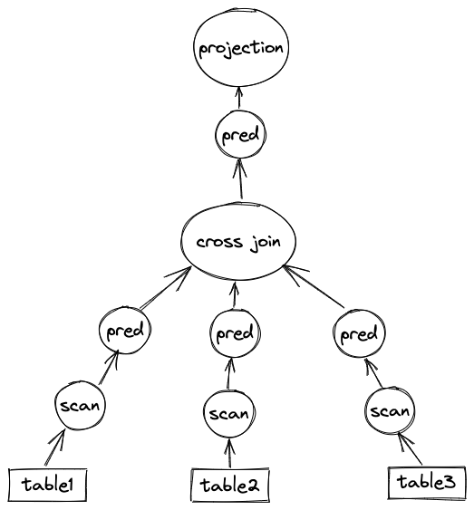

# A 10-Day Trip On MiniOB

## Prologue

完成的题目：

- SQL 执行：select-meta, update, insert, like, select-tables, join-tables, update-select, aggregation-func, order-by, group-by, having
- 索引：unique, multi-index, show-index
- 类型：date
- 其他：drop-table, clog

简历：

Oceanbase miniob 数据库大赛，设计并实现如下功能

- SQL 执行模块：支持多行 insert、多列 update、cross join、inner join、order by、group by、having、select 子查询、聚合等功能。
- 索引模块：支持单列索引、多列索引功能。
- 日志模块：为 insert、update、delete 提供 WAL（Write-Ahead Logging）支持。

因为我做 miniob 的主要目的是学习 SQL 执行部分，因此题目是选择性做的。少数几个题没有做，有些（例如 complex-sub-query，expression）觉得太麻烦，有些（例如 typecast，alias）觉得不是数据库中的核心内容，有些（例如 buffer pool）已经在其他课程中写过很多次了。

由于我开始做的时候，初赛已经接近尾声，导致后面很多题没有办法提测，只能对照着 mysql server 的输出进行测试，并且我的目的是学习，而不是通过测试。因此，很多题目的解决方案可能并不完备，非常可能有漏洞或错误。

## drop-table

实现删除某个表的功能，即支持 `drop table <table_name>;` 命令。

删除指的是将数据库中与给定的表相关的所有数据全部抹去，包括磁盘上和内存中的。

当使用 `create_table` 创建一个表时，会创建 table meta file，table data file。其中 table meta file 会直接创建，table data file 经由 buffer pool manager 创建。每个 table data file 会有一个关联的 buffer pool instance。

当使用 `create_index` 为某个表关联某个索引时，会创建一个 table index file。每个 index 对应一个 table index file，因此一个表可能有 0 个或多个 table index files。

在删除一个表时，首先将内存中的相关数据结构 close 或 free，再将磁盘上的 table meta file，table data file 和 table index files 删除。

难度：简单。

耗时：3个小时。主要工作量在于熟悉 miniob 架构与代码组织，以及开发和调试环境的搭建。

一些点：

- 为什么创建 table meta file 时，不经过 buffer pool manager？为了统一性，对于 disk file 的读取和写入不应该全部通过 buffer pool 吗？
- 为什么需要每个 table data file 关联一个 buffer pool instance，而不是所有的共用一个？

## select-meta

**注意，训练营及 miniob github repo 中关于该题目的描述是过时的，错误地沿用了 2021 select-meta 题目的描述。**

2022 select-meta 题目的要求是：为 select 查询实现类似 `SELECT *, ATTRIBUTES FROM RELATIONS [WHERE CONDITIONS]` 类似的功能，即支持 attribute list 中同时出现星号与具体的 attribute 名称。实际上，题目名字应该修改为 select-parsing。

语法解析相关的代码在 `yacc_sql.y` 中。定位到 select 语句的语法树，揣摩语法树的递归结构，稍微修改即可通过测试。

难度：简单。

耗时：15个小时。工作量大部分在于从错误的题目描述中抽离出来，以及从测试用例中反推题目的意图。另一小部分在于了解 yacc 的语法，以及揣摩 select 语法树的递归结构与 select SQL 语句的对应关系。

## update

该题目要求为 miniob 实现对 update 语句的支持，且仅要求一次更新单个 field。

难度：中等。

耗时：10个小时。工作量一部分在于完成 update resovling 部分，即对语义的检查，例如表是否存在、属性是否存在、操作符两端的类型是否匹配等等。condition 部分的正确性校验实际上不需要自己写， `FilterStmt` 已经实现了这部分的功能，但我一开始没有注意到。另一部分在于阅读几乎所有 `storage/common` 下的源码，重点理解 `delete_record` 和 `insert_record` 的实现，然后模仿。所耗时间的大部分在于思考与 transaction 相关的东西，然而实际上只有 clog 题目会使用 transaction，因此浪费了很多时间。

## insert

该题目要求实现 insert 语句支持一次插入多行的功能，同时需要保证插入多行数据的一致性，即如果有一行数据插入失败，就 rollback 其他已插入的行，并返回失败。当且仅当所有行数据均插入成功时，才返回成功。

难度：简单。

耗时：2个小时。工作量主要在于 insert 语法树的修改以及修改 `insert_stmt` 和 `insert_record` 对多行数据的插入进行适配。这题比较简单，是因为目前 miniob 的事务模块几乎没有存在感。

## date

该题目要求为 miniob 实现支持 DATE 类型的功能。

一开始受2021 date 题目官方解析的影响，在 parser 模块中添加了对 DATE_STR 的支持，即在做词法分析时，使用正则表达式捕捉正确格式的 DATE str，并且在 `lex_sql.l` 和 `yacc_sql.y` 中做了相应的添加或修改。后来才发现，在 parsing 阶段做正确性校验毫无意义，实际上对 DATE 输入的正确性校验应该推迟到 resolver 阶段，即在创建 insert, update, delete, select stmt 时，如果 field type 是 CHARS 类型，则判断 value data 是否为正确的 DATE str，再将 field type 修改为 DATES 类型，便于之后的处理。

做完正确性校验后，就需要探索哪些代码与 field type 有关。使用 vscode 的全局搜索功能，搜索已有的 INTS, FLOATS, CHARS 这几个 AttrType 在代码中出现的地方，仿照已有的写法添加对 DATES 类型的支持。

难度：困难。

耗时：6个小时。工作量一部分在于理清添加一个新类型需要修改的地方，并模仿 miniob 是如何处理其他已有类型的。另一部分在于编写与日期类型相关的代码。

## like

该题目要求为 where clause 添加支持 like 和 not like 的功能。

匹配时，需要考虑两个特殊字符，% 和 _。其中前者可以匹配零个或任意多个（相同或不同的）字符，后者可以匹配任意一个字符。

对于模式匹配，我使用的算法是回溯算法，算法思想借鉴了 LCS（longest common sequence）问题的经典动态规划解法。

难度：简单。

耗时：8个小时。工作量一部分在于修改 where clause 的 parsing，另一部分在于修改 predicator 以添加对 like 和 not like comparator 的支持。在测试时，发现输出的 char 类型数据总是被截断至 4 个字符，即默认的 char 类型长度。并且发现在插入一条数据时，竟然会修改上一条插入的数据（这是因为 record meta data 与 record data 没有 consistent 导致的）。由于之前没有用过 SQL，不知道在创建表时可以指定 CHAR(N)，即可以指定 CHAR 类型字段的长度，因此花费了大量时间阅读与修改底层的与 record 相关的代码。后来提交的时候，从测试用例中才发现可以指定 CHAR(N)。

## select-tables

该题目要求为 miniob 实现支持 select from multiple tables 的功能。

换句话说，要求实现 cross join 的功能，即输出多个表的 cartesian product。

目前，miniob 的 parsing 模块不支持 select from multiple tables 的词法解析，因此需要首先在 parsing 模块添加相关代码。

resolving 模块已经实现了对 select from multiple tables 的语义校验以及 select stmt 的生成，因此不需要修改。

之后来到 executing 模块。该模块的 `do_select` 函数在函数开头直接特判了多表的情况，并返回错误。因此，对 executing 模块的修改需要从此处开始。

观察到 miniob 的 SQL 执行引擎是火山模型，要实现输出 cartesian product，需要构建如图的 operator tree：

miniob 已经实现了 scan operator, predicate operator, projection operator，因此我们只需要再实现 cross join operator 即可。该 operator 的工作原理如下：其有多个 children，每个 child 对应一个子树。在调用 next 时，会 consume 所有 child iterators，拿到每个 table 经过过滤后的所有 tuples，再进行 cross join，得到 join 后的所有 tuples。我使用回溯算法进行 cross join。

由于 select stmt 没有区分表内的 condition 和 表间的 condition，因此在 `do_select` 中需要将它们提取出来，用于构建 operator tree 中的 predicate operators。

`do_select` 的工作即构建出这个 operator tree，再调用它，最后按照一定的格式输出 cartesian product。

难度：中等。

耗时：10个小时。工作量一部分在于 cross join operator 的实现及 operator tree 的构建。另一部分在于找 bug 和调试。

一些点：

- 如何 join 多个 tuple？实际上， `tuple.h`文件存在一段被注释掉的代码，这段代码定义了一个 `CompositeTuple` 类型，分析这个类型的 members，即可知道如何 join 多个 tuple。
- scan operator 会维护一个 tuple instance。每次从 table 中读取一个 record 后，会调用这个 tuple instance 的 `set_record` 方法，将这个 tuple 和读取到的 record 关联起来。它们的关系类似 buffer pool 中的 frame 和 page。scan operator 会将该 tuple 的地址（用指针变量存储）传到上层，供上层 consume。在我的设计中，cross join operator 在 open 时，会一次性地将所有 table 的所有 tuples 全部读取出来，然后存储在 cross join operator 中。由于存储的是 tuple 指针，因此实际上所有的 tuple 指针指向的都是 scan operator 中那个唯一的 tuple instance。当 scan operator 读取到一个新的 record 时，这个 tuple 又被用来存储这个新的 record。为了解决这个问题，我选择在内存中临时 new 新的 tuple，然后进行 deep clone。在 destory cross join operator 时，再回收资源。
    - 这样的做的问题有很多，首先做 deep clone 效率很低，其次遇到数据量较大的情况，内存可能不够。但是目前没有想到其他方法。
    - 另外还遇到了一些 memory bug，例如 double free 和 segfault。猜测可能是有一个 record manager 类似的角色，其会主动 free records。为了绕开这些 bug，直接放弃了在 cross join operator destruct 时 free memory。暂时未能定位错误。
- 做词法解析时，句子被分解成一颗树，即从大句子开始被分成小句子，最后分成一个个 token。这些 tokens 对应树中的 leaf nodes。分解对应递归的递过程，而 collect tokens 对应归过程，即从 leaf nodes 开始 collect。因此，类似 `select * from a,b,c` 这样的语句被解析后，select stmt 中 tables 的顺序为 `c,b,a` ，即逆序了。故为了获得正确的 cartesian product 输出顺序，需要在 `select_stmt` 文件中对 tables 进行逆序遍历。
- 目前尚未理解使用 backtracking 做 cross join 和使用循环做 cross join 的区别。一个猜想是做 backtracking 时可以尽早地进行 prunning，但是想不明白如何进行 prune。另外一个想法是实现一个类似 multi-way merge 的算法来做 cross join。

## join-tables

该题目要求为 miniob 实现 inner join 的功能。

inner join 与 cross join 的区别在于：cross join 会无条件地 concatenate 多个表的所有 rows，而 inner join 是有条件地 concatenate 多个表的 rows。这个 join 条件由 ON 语句给定。

因此，一种实现 inner join 的方法为：先做 cross join，得到多个表 concatenated 后的所有 rows。再根据所有 join conditions，对这些 rows 进行 filter。

虽然也有其他 join 算法，但通过阅读 miniob 的源码，我发现 inner join 的这种算法最容易理解和实现。如果已经实现了 cross join，那么只需要在顶部的 predicate operator 中添加 join condition 给定的 predicates 即可。

predicate operator 的核心函数为 `do_predicate`，其会从 filter stmt 中取出每个 filter unit，再进行比较。这些 filter unit 可以由 select 语句的 where clause 得到，也可以由 ON 语句的 where clause 得到。不需要区分这两者，直接将它们塞进同一个 filter stmt 中。在 `do_select` 函数的开始，我的代码会将表内 condition 和 表间 condition 分离出来，而表间 condition 则会被用来构建 operator tree 顶部的 predicate operator，用于过滤 cross join 得到的所有 concatenated rows，得到 inner join 的结果。这部分代码在解决 select-tables 题目时已经全部实现。

在完成 select-tables 的基础上，parsing 模块需要添加一些代码，以支持 multi table inner join 语句的解析。resolving 模块需要添加代码对 inner join 语句进行正确性校验，并将 join condition 转化为 filter unit，再塞进 filter stmt 中。为了 inner join 后 tuples 的顺序符合 inner join 语句的顺序，需要逆序遍历 inner joins。包括 `do_select` 在内的其他地方不需要任何修改。

以上是一开始的想法，后来为了统一性，我设计了一个 inner join operator，其是关于 predicate operator 的一个 wrapper。所有 join condition 对应的 filter unit 所组成的 filter stmt 存在这个 operator 中。这个 inner join operator sits 在 predicate operator 和 cross join operator 之间。

难度：中等。

耗时：6个小时。

一些点：

- 在 `yacc_sql.y` 文件中修改语法树时，使用这样的 convention：xxx_list 表示一个可能为空的东西，xxx 表示一个一定不能为空的东西。以 join 为例，由于可能 inner join 多个表，因此需要定义一个 inner join list，再定义一个 inner join item。
- 在写此题的过程中，终于理解了 `yacc_sql.y` 文件的内容。一条语句对应一个语法树，语句中的每条子语句对应树中的一个子树，语句中的每个 token 对应树中的 leaf node。类比函数调用：进入一个子树，等价于递归调用一个函数。当递归到底时，即解析到 leaf node 时，开始进行 token 的收集。由于每个函数有自己的 stack frame，函数内定义的 local vars 对于其他函数不可见，因此如需要在多个函数之间传递信息，就需要全局变量。在递归解析一个语法树不同层的句子时，也需要一个类似全局变量的东西来存储和传递信息。CONTEXT 就是这样一个全局变量。需要注意的是，正是因为它是一个全局变量，所以在解析完一个子树后，相关的 fields 要注意重置。

## order-by

该题目要求为 miniob 添加对 order by 关键字的支持，即实现根据给定的 fields 对 select 输出进行排序的功能。

从 operator tree 的角度来讲，只需要在 projection operator 和 join operator 之间添加一个 order by operator 即可。该 operator 在 open 时，从 join operator 中一次性拿到所有 tuples（在我的实现中，cross join operator 总是存在的，即使 select from 语句中只出现了一个 relation）。再根据给定的 fields 对它们进行排序，并存储在 order by operator 内，供 projection operator consume。

难度：简单。

耗时：3个小时。工作量一部分在于扩充 parsing 和 resolving 模块，支持 order by 语句。另一部分在于 order by operator 的实现。

一些点：

- 如何进行排序呢？注意到 Tuple 类有一个 `find_cell` 方法，其根据传入的 Field 返回一个 TupleCell，而 TupleCell 实现了一个 `compare` 方法，可以用这个方法对两个 cell 进行比较。之后只需要自定义一个 comparator，然后利用 C++ 提供的 sort 函数进行排序。可以每个 key 调用一次 sort，也可以在自定义的 comparator 中一次比较多个 key。为了简洁性，我选择前者。
- 需要保证排序时比较的 keys 的顺序与 select 语句中 order by keys 的顺序保持一致。

## aggregation-func

该题目要求为 miniob 添加 aggregation 相关的功能，需要支持 max, min, avg, sum, count 聚合函数。

我实现了一个 aggregation operator，其 sits 在 predicate operator 之上。由于 order by operator 和 aggregation operator 是冲突的，因此根据是否有 aggregations，进行分支。如果没有 aggregations，那么 order by operator 接上 predicate operator，否则 aggregation operator 接上 predicate operator。

aggregation operator 可以做 incremental aggregation，即每次从 child 中取一个 tuple，然后用该 tuple 的 data 去更新所有 aggregations。也可以做 batch aggregation，即从 child 中一次性取出所有 tuples，再直接计算完毕所有 aggregations。两种写法代码量差不多，但是后者稍微容易写一点，因此我使用的是 batch aggregation。

由于不能再依靠 projection operator 进行输出，因此需要为 aggregation operator 实现一个输出函数 `print_aggr_results` ，按照一定的格式打印 aggregation results。

难度：中等。

耗时：10个小时。工作量一部分在于为 aggregation 添加 parsing 和 resolving 支持，另一部分在于 aggregation operator 的编写。难度较简单，但是代码量比较大。

一些点：

- int 类型做 avg 时，需要转换成 float。
- avg 时，注意 tuples 的数量为 0。
- 对 chars 使用 avg 或 sum 是未定义行为，在 resolving 阶段就可以过滤掉。
- 需要对 date 类型的 sum 和 avg 做特殊处理。
- 需要对 count(*), count(1), count(’A’) 等 count(literal) 做特殊处理。

## update-select

该题目包含两个要求，（1）支持一次 update 多个 fields；（2）二是支持 update 与 select 结合，即使用 select 子查询的结果指导本次 update。

前者比较简单，只需要在 update 单个 field 的基础上稍微扩展一下。

对于后者，首先需要较大地修改 parsing 和 resolving 模块。对于 executing 模块，我的解决方案是：在 `do_select` 中进行特判，如果有 update 需求，就在 projection operator 之后，再接一个 update operator，所有的更新在 update operator 中完成。

难度：中等。

耗时：10个小时。

## group-by

## clog

## unique

## multi-index

## show-index

该题目要求根据一定的格式打印某个表相关的所有索引。

需要考虑 unique index 和 multi index，因此在完成 unique index 和 multi index 后才能写该题目。

难度：简单。

耗时：1.5个小时。

# 课程感受

难度：中等。

耗时：如果是单人，有较好的编程基础和数据库基础，按每天8小时计算，大概需要10~15天。如果是合作，大概需要7~10天。我在做 miniob 之前，上一次接触数据库的内容还是在一年多以前的 CMU 15445，因此一开始进度很慢，后来熟悉了代码、补习了数据库知识之后，进度就快起来了。

收获：之前做 CMU 15445 时，注意力集中在存储部分，例如 buffer pool 和 B+ tree index, extendible hash index。在做 tinykv 时，从 Percolator 入手熟悉了事务相关内容。一直没有找到好的材料学习 SQL 执行这一部分的内容，miniob 则补全了这一块，这也是我选择做 miniob 的初衷。

建议：

- 希望官方为每个主流系统平台提供一个编译好的 observer 可执行文件，可以在不暴露测试用例和源码的前提下，帮助我们了解程序的正确输出、提高测试的效率。
- 细化评分。目前仅有通过和不通过，写了很多代码，通过了大部分测试用例，却得0分。希望按照通过的测试用例的数目占比进行评分，这样也可以提高竞争的激烈度。
- 更新过时的文档。我被包括 select-meta 在内的几个过时的文档困扰了很久，至少浪费了10个小时。
- 点明每个题的前置题。
- 添加必要的注释。
- 维护历年竞赛的优秀题解和讨论。在学习国外优秀公开课的过程中，我发现一个有极大帮助的点就是历年课程的讨论都被保存下来，这可以帮助参赛者在优秀的前人成果的基础上，将主要精力花费在开拓和创新上。
- 提测系统每隔一段时间就需要重新登录，非常不方便。